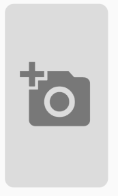

# image_selector_formfield

This widget is a form field that allows the user to pick a image from gallery (soon from camera too), and then crop it. The widget is customizable and has all the posibilities expected on a Form Field.

This widget is using and depends on this other widgets:

 - [image_picker_modern: ^0.4.12+3 ](https://pub.dev/packages/image_picker_modern)
 - [image_cropper: ^1.1.0](https://pub.dev/packages/image_cropper)
 - [cached_network_image: ^2.0.0-rc](https://pub.dev/packages/cached_network_image)

 So, you need to follow the Installation Guide from each of them.

## Getting Started

To use this package, you only need to install/import it to the project and then call it in the Widget's Build method.


## Usage

This widget is design to create/update a Image like a Profile Photo from a user on any app. So, if the user has a photo already, put the image url in the property ImageURL to display it. If the user tap on the widget, the picker will allow him/her to select a image, crop it and then displaying the result.

Some visuals can be customized:
 - widget Icon,
 - widget background Color
 - widget shape: Circle or Rectangle
 - Aspect Ratio: is calculated from RatioX and RatioY; default 9/16. In circular shape is locked to 1:1
 - borderRadius:  customize size in circular shape and border radius on Rectangle corners 


## Example 

```
ImageSelectorFormField()
```




```
ImageSelectorFormField(
    cropRatioX: 16,
    cropRatioY: 9,
)
```


```
ImageSelectorFormField(
    cropStyle: CropStyle.circle,
)
```


```
ImageSelectorFormField(
   cropStyle: CropStyle.circle,
   icon: Icon(Icons.add_photo_alternate,size: 100,color: Colors.green,),
   backgroundColor: Colors.blueGrey,
   errorTextStyle: TextStyle(color: Colors.red),
   onSaved: (img) {
     print("ON SAVED EJECUTADO");
   },
   validator: (img) {
     print("validator EJECUTADO");
     return "Error Text";
   },
   cropRatioX: 9,
   cropRatioY: 16,
 )
```


This project is a starting point for a Dart
[package](https://flutter.dev/developing-packages/),
a library module containing code that can be shared easily across
multiple Flutter or Dart projects.

For help getting started with Flutter, view our 
[online documentation](https://flutter.dev/docs), which offers tutorials, 
samples, guidance on mobile development, and a full API reference.
